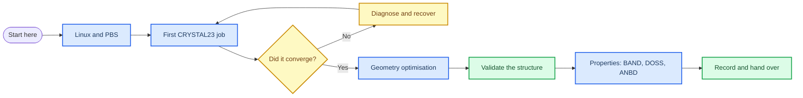

# CRYSTAL23 workflows for periodic materials

_A practical onboarding guide for reproducible computational research with CRYSTAL23._

---

This handbook is written for a student who has never used a Linux cluster or a periodic-DFT code. It follows one complete workflow: prepare a calculation, submit it to a PBS-managed cluster, decide whether it really converged, and only then analyse properties such as BAND, DOSS and ANBD.

It is deliberately different from the official CRYSTAL tutorial. The official material is the authoritative reference for keywords and property calculations; this handbook adds the operational context that a new student usually needs first: file organisation, job submission, checkpoints, failure recovery, provenance and handover.[^1]

## 📚 Start here

Choose the route that matches your goal:

| Goal | Start with | Outcome |
| --- | --- | --- |
| I have never used a cluster | [Before you run anything](docs/00-before-you-run.md) | Understand what CRYSTAL files and convergence states mean |
| I need to submit a job | [Linux and PBS essentials](docs/01-linux-and-pbs.md) | Submit, monitor and inspect a first job |
| I want to run BAND or DOS | [Properties overview](docs/07-properties-overview.md) | Build properties inputs from a trusted wavefunction |
| I am taking over an existing project | Project organisation *(under construction)* | Trace every figure back to its input and output |

## 🧭 The learning path



## 🎯 What this handbook teaches

- How to distinguish a submitted job from a scientifically usable result
- How SCF convergence and geometry convergence are different checks
- How to organise inputs, outputs, wavefunctions and figures
- How to run properties only from a validated converged calculation
- How to make a reasoned choice about basis sets, k-points, smearing and slab thickness
- How to leave a calculation that another student can reproduce

## 🔒 Scope and safety

This handbook uses generic PBS examples. Cluster resource names, module names, executable paths and wall-time limits are site-specific; replace the marked placeholders with the values supplied by your local HPC service. Never publish credentials, private paths, unpublished structures or raw data that your supervisor has not approved for release.

The examples teach a workflow, not a universal production protocol. A successful command is not evidence that a model is physically adequate. Keep the input, output, convergence evidence and scientific justification together.

## 🗂️ Repository map

```text
crystal23-handbook/
|-- README.md
|-- docs/
|   |-- 00-before-you-run.md
|   |-- 01-linux-and-pbs.md
|   |-- 02-first-crystal23-job.md
|   |-- 03-reading-input-and-output.md
|   |-- 04-scf-convergence.md
|   |-- 05-geometry-optimisation.md
|   |-- 06-convergence-as-evidence.md
|   |-- 07-properties-overview.md
|   |-- 08-band-structure.md
|   `-- 09-density-of-states.md
|-- examples/
|-- templates/
`-- references/
```

Planned modules after `09` are bonding analysis, bulk and slab workflows, the surface case study, project management and troubleshooting. They will be added with tested examples rather than empty placeholder pages.

## 📖 Official references

The official CRYSTAL properties tutorial remains the source of truth for the detailed syntax of PPAN, ECHG, BAND, DOSS, COOP and COHP.[^1] This handbook links back to the official documentation at the point where a reader needs the complete keyword reference.

[^1]: CRYSTAL Solutions. (n.d.). *Properties tutorial*. https://tutorials.crystalsolutions.eu/tutorial.html?td=properties&tf=properties_tut
