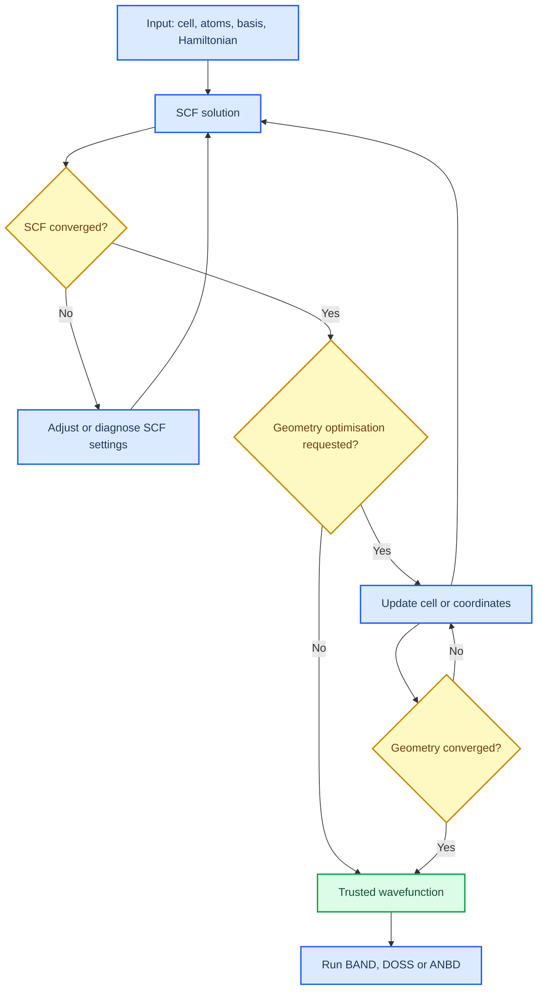

# Before you run anything

_Estimated time: 20 minutes | Difficulty: Beginner | Last verified: 2026-09-05_

---

This page gives you the mental model for the rest of the handbook. You do not need to know every keyword yet. You do need to know which files are inputs, which files are evidence and what a finished calculation looks like.

## 🎯 Learning goals

By the end of this page, you should be able to:

- explain what a periodic DFT calculation is solving;
- distinguish SCF convergence from geometry convergence;
- identify the files that preserve a calculation's history; and
- decide whether a result is ready for BAND, DOSS or ANBD.

## 🧱 The CRYSTAL23 mental model

CRYSTAL describes a solid with a repeating unit cell, a basis set and an electronic-structure method. It first solves the electronic problem for one fixed structure. During geometry optimisation, it updates the cell and/or atomic coordinates and repeats the electronic calculation until the selected force, displacement and energy criteria are met.[^1]

## 🔍 Three meanings of "done"

| State | What it means | Evidence to look for |
| --- | --- | --- |
| Job completed | The scheduler process stopped and produced files | The queue entry ends and output/error logs exist |
| SCF converged | The electronic density and energy met the SCF criteria | The output reports convergence and a final energy |
| Geometry converged | The structure met the optimisation criteria after repeated SCF cycles | The output reports convergence, forces and displacements |

> ⚠️ **Important:** A job can complete without being scientifically usable. Always check the output, not only the queue status.

## 🗃️ Files you will meet

File names vary between local scripts and cluster wrappers, but the roles are stable:

| File or pattern | Role | Preserve it? |
| --- | --- | --- |
| `*.d12` | Main input: structure, basis, Hamiltonian, k-points and SCF/optimisation settings | Yes |
| `*.d3` | Properties input for BAND, DOSS, ANBD and related analyses | Yes |
| `*.out` | Human-readable output and the first place to check convergence | Yes |
| `fort.9`, `fort.98` | Wavefunction/restart files used by many properties runs | Yes |
| `*.f25`, `*.f98` or local property files | Machine-readable data produced by a particular run | Yes, when used by the analysis |
| `*.qsub` | PBS resource request and execution commands | Yes |

Do not assume that a file is interchangeable merely because its name looks similar. A BAND or DOSS calculation must use the wavefunction from the intended, converged parent calculation.

## ✅ Pre-run checkpoint

Before submitting a job, record these six items in a short calculation note:

1. Material and structural model
2. Hamiltonian and basis set
3. k-point sampling
4. SCF and optimisation thresholds
5. Expected output files
6. The scientific question the calculation is meant to answer

If you cannot fill in item 6, do not submit a large production job. Start with a small validation calculation or ask which decision the run should support.

## 🚀 Next step

Continue to [Linux and PBS essentials](01-linux-and-pbs.md). It explains the terminal commands and scheduler actions used in every later page.

## References

[^1]: Dovesi, R., Erba, A., Orlando, R., et al. (2020). *The CRYSTAL code, 1976–2020 and beyond: a long story*. The Journal of Chemical Physics, 152, 204111. https://doi.org/10.1063/5.0004892
