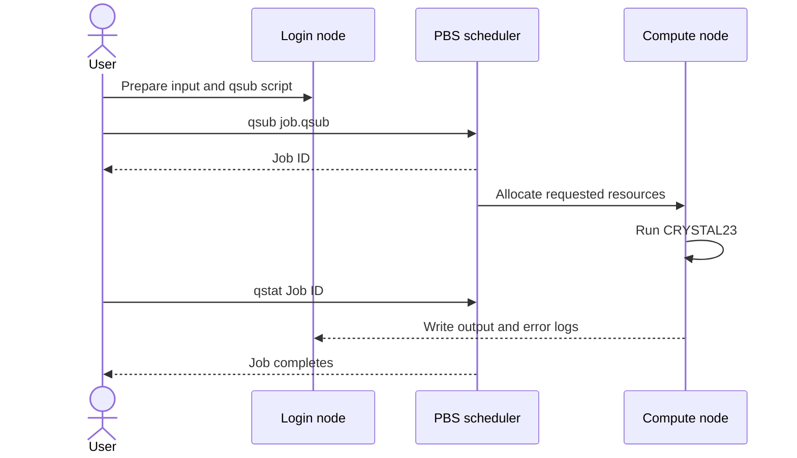

# Linux and PBS essentials

_Estimated time: 30 minutes | Difficulty: Beginner | Last verified: 2026-09-05_

---

This page teaches the minimum cluster workflow needed to run CRYSTAL23 safely. You will learn how to move through directories, submit a PBS job, monitor it and identify the output that needs scientific inspection.

## 🖥️ What HPC and PBS mean

**HPC** means *high-performance computing*: a shared collection of compute nodes used for jobs that are too large or too slow for a personal computer. **PBS** is the scheduler interface used to request resources and place a job in the queue. You submit a script with `qsub`; the scheduler decides when and where it runs; you inspect it with `qstat`.[^1]



> 📌 **Rule:** Use the login node for editing, light inspection and submission. Run CRYSTAL23 on an allocated compute node through PBS unless your local HPC instructions explicitly say otherwise.

## 📋 Prerequisites

| Requirement | How to check | What success looks like |
| --- | --- | --- |
| Cluster account and login method | Follow your institution's HPC guide | You can open a shell on the login node |
| CRYSTAL23 access | Use the module or executable path supplied by your group | The command is available inside a test job |
| PBS commands | `command -v qsub` and `command -v qstat` | Both commands return a path |
| A validated training input | `ls examples/first_job` | The input and submission script are present |

## 🔧 Essential terminal commands

Run these commands one at a time:

```bash
pwd                 # print the current directory
ls -lah             # list files, including sizes and hidden files
cd path/to/project  # move into a directory
mkdir -p jobs logs  # create directories, including missing parents
cp input.d12 jobs/  # copy an input without changing the original
less calculation.out
grep -n "converg\|SCF\|ERROR" calculation.out
tail -f calculation.out
```

Press `q` to exit `less`. Press `Ctrl-C` to stop `tail -f`; this stops the display, not the running cluster job.

## 🗂️ A small project layout

Use one directory per calculation family. Keep generated files away from the source input so that a failed run can be diagnosed without losing the starting point.

```text
project-name/
|-- inputs/          # hand-edited .d12 and .d3 files
|-- jobs/            # .qsub scripts
|-- logs/            # scheduler stdout and stderr
|-- outputs/         # .out and wavefunction files
|-- properties/      # BAND, DOSS and ANBD runs
|-- figures/         # exported plots, never the only copy of raw data
`-- notes/           # calculation passport and failure log
```

## 🚀 A generic PBS submission script

The following is intentionally site-neutral. Replace the marked resource and executable lines with the configuration provided by your HPC administrator or research group.

```bash
#!/bin/bash
#PBS -N crystal_training
#PBS -l select=1:ncpus=8:mem=16gb
#PBS -l walltime=01:00:00
#PBS -j oe

set -euo pipefail
cd "$PBS_O_WORKDIR"

# Replace this with your site's CRYSTAL23 setup.
# module load crystal23

crystal < inputs/training.d12 > outputs/training.out
```

Save it as `jobs/training.qsub`, create the output directory, and submit it from the project root:

```bash
mkdir -p outputs logs
qsub jobs/training.qsub
```

**Expected output:** PBS returns a job identifier similar to `123456.server`. The exact format depends on the cluster.

## 🔍 Monitor and inspect the job

```bash
qstat -u "$USER"
qstat 123456.server
less outputs/training.out
grep -n "converg\|SCF\|ERROR" outputs/training.out
```

| Observation | Interpretation | Next action |
| --- | --- | --- |
| Job is queued | PBS has accepted the request but resources are not available yet | Wait; do not resubmit repeatedly |
| Job is running | The process has started | Inspect the output occasionally |
| Job disappeared | It may have completed, failed or been deleted | Check output, error log and exit status |
| Output stops during SCF | The calculation may be slow or stuck | Inspect the last iterations and scheduler log |

To stop a job that you have verified should not continue:

```bash
qdel 123456.server
```

Only delete the specific job ID you intend to stop. A deleted job is not a failed calculation record; keep its output and note why it was stopped.

## 🧪 Verification checklist

- [ ] `pwd` shows the intended project directory
- [ ] The input file is present and readable
- [ ] The qsub script uses the correct site-specific executable setup
- [ ] PBS returns a job ID
- [ ] The output file is created in the expected directory
- [ ] The output contains an explicit convergence result before you use it for properties

## 🔧 Common problems

### `qsub: command not found`

Your shell is not on the expected cluster or the scheduler environment is not loaded. Confirm the hostname and consult the local HPC instructions; do not install a second scheduler client inside the project.

### `Unknown resource` or an invalid `select` line

PBS resource names differ between sites. Copy a working resource request from your institution's documentation or a group-maintained template, then change only one resource at a time.

### The job completes but no useful output is present

Check the working directory, executable setup, input path and scheduler error log. A zero-length or very short `.out` file is not evidence of a successful CRYSTAL23 run.

## 🚀 Next step

Continue to [Your first CRYSTAL23 job](02-first-crystal23-job.md). That page will add a training input and a pass/fail checkpoint for the first calculation.

## References

[^1]: OpenPBS. (n.d.). *OpenPBS documentation and project resources*. https://www.openpbs.org/
