# Reading CRYSTAL23 input and output

_Estimated time: 35 minutes | Difficulty: Beginner | Last verified: 2026-09-05_

---

CRYSTAL input files are compact, but each block answers a different scientific question. This page teaches you to read an input from top to bottom and to inspect an output in the order that prevents common false conclusions.

## 🎯 Learning goals

- Identify the structural, methodological and numerical choices in a `.d12` file
- Explain what a `.d3` properties input is connected to
- Find the final SCF and geometry status in an `.out` file
- Record the choices that affect reproducibility

## 🧩 Read the input in layers

Treat the input as a chain of decisions rather than a wall of keywords:



```mermaid
flowchart LR
    accTitle: CRYSTAL23 Input Layers
    accDescr: A CRYSTAL23 input moves from the periodic structure through the electronic method and numerical sampling to convergence and optimisation controls.

    structure[Structure: cell and atoms] --> basis[Basis set]
    basis --> method[Hamiltonian and XC treatment]
    method --> sampling[Brillouin-zone sampling]
    sampling --> controls[SCF and optimisation controls]
    controls --> output[Expected output and restart files]

    classDef primary fill:#dbeafe,stroke:#2563eb,stroke-width:2px,color:#1e3a5f
    classDef output_state fill:#dcfce7,stroke:#16a34a,stroke-width:2px,color:#14532d
    class structure,basis,method,sampling,controls primary
    class output output_state
```

### Structure

Check the chemical formula, dimensionality, lattice parameters, atom count and coordinate convention. For a slab, also check the vacuum direction and whether the cell is periodic in the intended two dimensions.

### Basis and Hamiltonian

The basis set and Hamiltonian are part of the model, not implementation details. Write them into the calculation note exactly as they appear in the input. A change from one hybrid functional or basis to another creates a new calculation branch that must be tracked separately.

### Sampling and numerical controls

Record the k-point sampling, electron smearing, SCF threshold, mixing, maximum cycles and any restart or guess option. These settings can determine whether a metallic or near-metallic calculation reaches a stable solution.

### Properties input

A `.d3` file is not a second geometry optimisation. It tells the `properties` program what to analyse from a previously generated wavefunction. BAND, DOSS, ANBD and related analyses are only meaningful when the parent wavefunction belongs to the intended converged calculation.[^1]

## 🔍 Inspect the output in order

Use this order every time:

1. **Identity:** confirm the structure, basis, Hamiltonian and k-point setup match the input you intended to run.
2. **Execution:** confirm the expected executable started and that the output is not truncated at the beginning.
3. **SCF:** inspect the final iterations and look for an explicit convergence message.
4. **Geometry:** if optimisation was requested, check the final forces, displacements and optimisation status.
5. **Artifacts:** confirm the wavefunction/restart files needed by later properties runs exist and belong to this calculation.

Useful searches for a text output are:

```bash
grep -n "SCF ENDED\|SCF CONVERGENCE\|OPT END\|CONVERGED" calculation.out
grep -n "TOTAL ENERGY\|FINAL ENERGY\|LATTICE" calculation.out
tail -n 80 calculation.out
```

The exact wording can vary with the CRYSTAL version and wrapper. Treat these strings as search hints, not as a substitute for reading the surrounding lines.

## ✅ A defensible completion record

Do not write only "job finished". Record a compact status like this:

```text
Material: training system
Input: inputs/training.d12
Hamiltonian/basis: [copy exactly from input]
SCF: converged at cycle [N], final energy [value]
Geometry: [not requested / converged / not converged]
Wavefunction: [file names and timestamp]
Properties-ready: [yes / no, with reason]
```

This record makes it possible for another student to understand what happened without guessing from a directory full of files.

## ⚠️ Common reading errors

### "The output file exists, so the run worked"

An output file can be created before the executable fails. Check the last lines, scheduler error log and explicit SCF/geometry status.

### "SCF converged, so the structure is optimised"

SCF convergence refers to the electronic state for one geometry. Geometry convergence is a separate test over forces, displacements and energy changes.

### "The BAND plot looks reasonable, so the path must be correct"

The path is part of the physical interpretation. For bulk and two-dimensional slabs, use the reciprocal-space convention appropriate to the dimensionality and record the high-symmetry points in the calculation note.

## 🚀 Next step

Continue to [SCF convergence](04-scf-convergence.md) to learn how to recover a difficult calculation without changing several scientific assumptions at once.

## References

[^1]: CRYSTAL Solutions. (n.d.). *Properties tutorial*. https://tutorials.crystalsolutions.eu/tutorial.html?td=properties&tf=properties_tut
