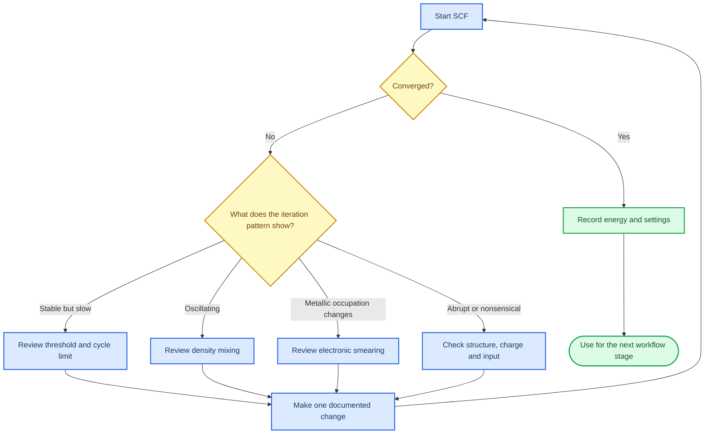

# SCF convergence

_Estimated time: 40 minutes | Difficulty: Beginner to intermediate | Last verified: 2026-09-05_

---

The self-consistent-field (SCF) procedure updates the electron density until the input density and the calculated density are consistent to the requested threshold. A calculation that reaches the maximum number of cycles without meeting that threshold is not an accepted final result, even if the last few energies look smooth.

## 🎯 Learning goals

- Recognise the difference between an SCF failure and a slow calculation
- Change one numerical control at a time and keep an audit trail
- Use smearing and mixing deliberately for metallic or near-metallic systems
- Decide when to stop recovering a run and revisit the model

## 🔄 The SCF decision loop



## 🧰 Controls you will encounter

The exact syntax and defaults are version- and workflow-dependent; consult the [official CRYSTAL documentation](https://www.crystal.unito.it/documentation.html) before changing a production input.[^1]

| Control | Practical meaning | Safe first question |
| --- | --- | --- |
| `TOLDEE` | Energy threshold used in the SCF convergence test | Is the requested threshold appropriate for this stage? |
| `MAXCYCLE` | Maximum number of SCF iterations allowed | Is the run genuinely converging, or only consuming more cycles? |
| `FMIXING` | Fraction used when mixing the new density with the previous density | Is the density oscillating and would gentler mixing help? |
| `SMEAR` | Electronic occupation broadening that can stabilise metallic or near-metallic SCF iterations | Is smearing being used as a numerical aid and reported with its units? |
| `GUESSP` | Reuses a previous density/wavefunction guess when the workflow supports it | Does the restart file belong to the same structure and method? |

### Smearing is not lattice temperature

In CRYSTAL workflows, a smearing value is an electronic occupation parameter. It may be converted to an equivalent electronic temperature for reporting, but that value is not the physical temperature of the crystal. Keep the parameter, unit and reason in the calculation passport; do not describe it as the sample temperature.

### Mixing changes numerical behaviour, not the scientific question

Changing `FMIXING` can help an unstable iterative procedure reach a solution. It does not replace a convergence test and does not justify accepting an unconverged density. Compare the final energy and convergence status after the change.

## 🧪 A controlled recovery protocol

When a run fails, create a new attempt rather than overwriting the original evidence:

```text
attempt_01: original input, failed after [N] cycles
attempt_02: changed only [one control], reason [short explanation]
attempt_03: changed only [one control], reason [short explanation]
```

For every attempt, preserve the input, qsub script, output and scheduler log. Stop and revisit the structure or charge if the iterations show discontinuities, impossible energies or evidence that the wrong restart file was read.

## ✅ SCF checkpoint

Accept an SCF result only when all of the following are true:

- The output contains an explicit convergence indication
- The final energy is present and numerically plausible for the calculation family
- The run did not stop at `MAXCYCLE`
- The input and restart files are the intended pair
- The recovery log explains any non-default smearing or mixing choice

## 🚀 Next step

After SCF convergence is reliable, continue to [Geometry optimisation](05-geometry-optimisation.md). Geometry optimisation adds a second convergence layer and should be checked separately.

## References

[^1]: CRYSTAL Solutions. (n.d.). *CRYSTAL documentation*. https://www.crystal.unito.it/documentation.html
