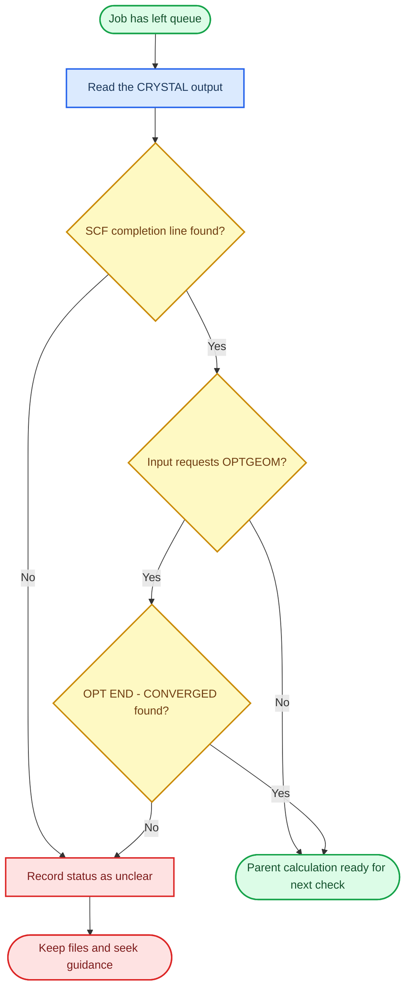

# Checking SCF completion

This project checked SCF completion from the CRYSTAL output line, not from a guessed collection of search terms.

## What SCF means here

SCF is the electronic part of the calculation. CRYSTAL repeats the electronic solution until the energy criterion is satisfied for the current structure. During a geometry optimisation, this electronic check is repeated at each geometry step.

## Check a completed run in order

Use this flow when a job has left the queue. It separates the scheduler status, SCF completion and geometry completion, which answer different questions.



## The project check

Run the command for the file you are checking:

```bash
grep "SCF E" OPT0.out
```

For the atomic optimisation:

```bash
grep "SCF E" ATOMOPT0.out
```

A successful SCF step contains:

```text
== SCF ENDED - CONVERGENCE ON ENERGY E(AU) ...
```

The output also reports the number of SCF cycles. An optimisation can contain several SCF completion lines, one for each geometry step. Once `OPT END - CONVERGED` has also been found, record the energy and cycle count from the final SCF step.

## What this check does not prove

SCF convergence means that the electronic calculation reached its energy criterion for the current structure. It does not by itself prove that:

- the geometry optimisation converged;
- the input used the intended structure;
- a properties calculation used the intended parent; or
- the result answers the research question.

Check each of those separately.

## A short record

```text
Calculation: OPT0
Output: OPT0.out
SCF status: SCF ENDED - CONVERGENCE ON ENERGY
Final energy: [copy exactly from the output]
SCF cycles: [copy exactly from the output]
Geometry status: [check separately]
```

## If the line is missing

Do not replace this check with a broader, unverified command. Open the output:

```bash
less OPT0.out
```

Search inside `less` with `/SCF E`, press `n` for the next match and `q` to quit. Keep the output and scheduler files for diagnosis. The recovery procedure for this project has not yet been formalised in this handbook.

## Checkpoint

Do not proceed to a geometry or properties page until you can locate the SCF completion line and, for an optimisation, its final `OPT END - CONVERGED` line. If the SCF line is missing, record the run as “status unclear” rather than “converged”.

## Next

Continue to [Managing geometry optimisation](05-geometry-optimisation.md).
