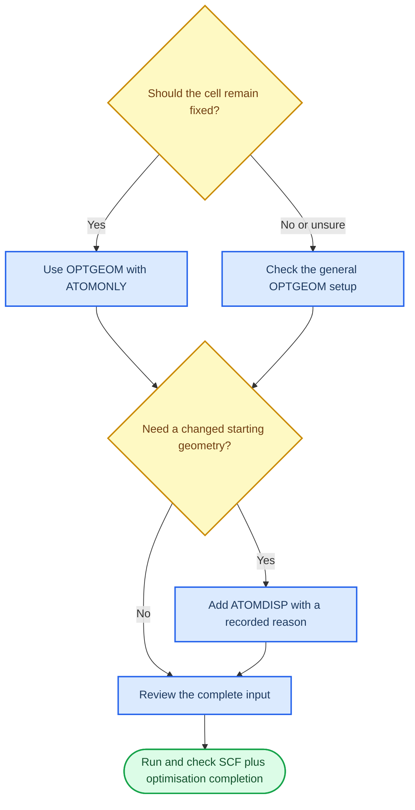

# Geometry optimisation

The completed project contains two related optimisation routes:

```text
OPT0 -> OPT1
ATOMOPT0 -> ATOMOPT1
```

The names and input differences preserve which structure was optimised and which calculation followed it.

## What you will learn

You will learn how `OPTGEOM`, `ATOMONLY` and `ATOMDISP` appear in the inputs, and how to distinguish an SCF-converged step from a fully converged geometry optimisation.

## Optimisation in the input

The basic optimisation block is:

```text
OPTGEOM
ENDOPT
ENDGEOM
```

`ATOMOPT0` includes:

```text
OPTGEOM
ATOMONLY
ENDOPT
ENDGEOM
```

This is the project evidence for an atomic-only optimisation. Do not generalise this block to a different system without checking the input requirements.

## `OPTGEOM` and `ATOMONLY`

In this handbook, “general optimisation” means a calculation with the `OPTGEOM ... ENDOPT` block. `OPTGEOM` starts that geometry-optimisation section; the example inputs do not use a separate `OPT` keyword.

`ATOMONLY` is an option inside that block. It restricts the optimisation to atomic coordinates while leaving the unit cell unchanged in this project. The difference is therefore:

| Input choice | What is allowed to change |
| --- | --- |
| `OPTGEOM` without `ATOMONLY` | The optimisation follows the cell/coordinate behaviour specified by the calculation |
| `OPTGEOM` with `ATOMONLY` | Atomic positions are optimised; the cell is kept fixed in this project |

This is why `OPT0` and `ATOMOPT0` are recorded as different routes. `OPT0.d12` contains `OPTGEOM`; `ATOMOPT0.d12` contains `OPTGEOM` and `ATOMONLY`. The choice should follow the scientific question: use the atomic-only route when the lattice is already fixed and only internal positions should relax. Confirm the exact scope in the CRYSTAL23 manual before using it for another system.

`ATOMDISP` is different again. It supplies explicit atomic displacements for a new input, as seen in `ATOMOPT1` and `OPT1`; it is not another name for `ATOMONLY`.



Read the two decisions independently. `ATOMONLY` controls what may relax during optimisation. `ATOMDISP` changes the starting coordinates before that optimisation begins.

## Check the output

First check SCF completion:

```bash
grep "SCF E" ATOMOPT0.out
```

Then check optimisation completion:

```bash
grep "OPT END" ATOMOPT0.out
```

The completed output also contains:

```text
CONVERGENCE TESTS SATISFIED AFTER ...
* OPT END - CONVERGED *
```

The output reports gradient and displacement tests before this final line. Preserve the output rather than copying only the final energy.

## Continue with a changed structure

The project created a new input for a follow-on calculation by retaining the prior input:

```text
ATOMOPT1.d12
ATOMOPT1.d12.beforeINSDISP
```

The new input contains `ATOMDISP` values and, in this example, `BREAKSYM`. Compare the files before submitting:

```bash
diff ATOMOPT0.d12 ATOMOPT1.d12
```

The displacement values are part of this project workflow. Their scientific origin and the choice to break symmetry must be recorded with the calculation; they should not be invented by a general tutorial.

## Geometry evidence to retain

The optimisation wrapper saved:

```text
ATOMOPT0.OPTINFO
ATOMOPT0.SCFLOG
ATOMOPT0.optstory/
ATOMOPT0.xyz
ATOMOPT0.gui
```

The `.optstory` directory contains the sequence of geometry files generated during optimisation. Keep it when the optimisation history matters.

## Checkpoint

For an optimisation you want to use later, record:

- whether the cell was allowed to change;
- whether `ATOMONLY` was present;
- whether `ATOMDISP` supplied a new starting geometry;
- the SCF completion line; and
- the `OPT END - CONVERGED` line.

## Next

Continue to [Managing calculation versions](06-convergence-as-evidence.md).
