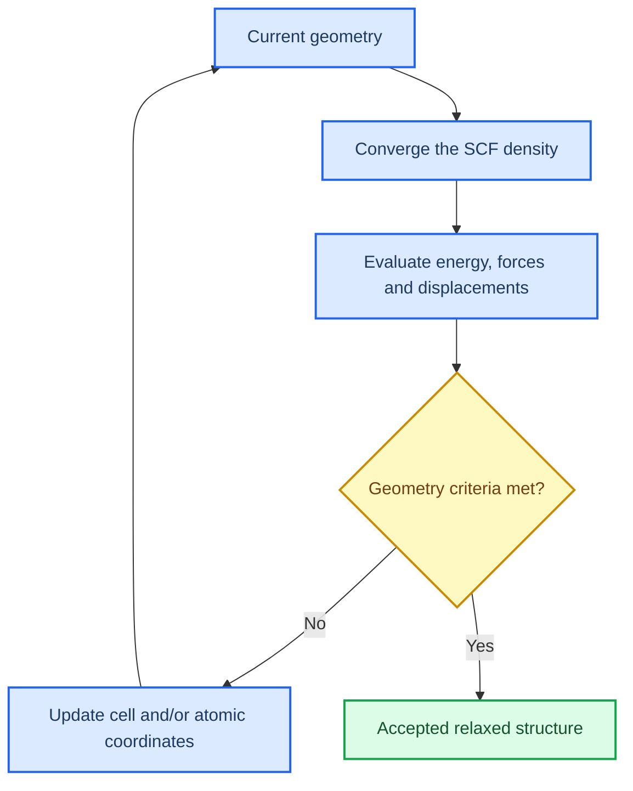

# Geometry optimisation

_Estimated time: 35 minutes | Difficulty: Beginner to intermediate | Last verified: 2026-09-05_

---

Geometry optimisation searches for a structure that meets the force, displacement and energy criteria set in the input. Each optimisation step needs a converged electronic solution before the geometry can be updated.

## 🎯 Learning goals

- Distinguish a fixed-geometry SCF calculation from a relaxed structure
- Explain the difference between cell optimisation and atomic-coordinate optimisation
- Verify forces, displacements and the final optimisation status
- Keep slab constraints and symmetry choices explicit

## 🧭 Two layers of convergence



## 🧱 What is being optimised?

| Choice | What changes | Typical use |
| --- | --- | --- |
| Fixed-geometry SCF | Nothing in the structure | Final energy or properties at a specified geometry |
| Atomic-coordinate optimisation | Atomic positions within a fixed cell | Local relaxation, adsorption height, surface rumpling |
| Cell optimisation | Lattice parameters and often atomic positions | Bulk equilibrium structure |
| Constrained slab optimisation | Selected coordinates are fixed or restricted | Preserve a bulk-like centre while relaxing the surface |

The keyword and constraint syntax depends on the calculation. In your record, state whether the cell, atoms or both could relax. Also record frozen layers and symmetry restrictions.[^1]

## 🔍 Inspect the final output

Search for the final optimisation block and then read the surrounding lines:

```bash
grep -n "OPT END\|CONVERGED\|FORCES\|DISPLAC" relaxed.out
tail -n 120 relaxed.out
```

A useful completion record contains:

```text
Optimisation type: [cell + coordinates / coordinates only / constrained slab]
SCF status at final step: converged
Final energy: [value and units as printed]
Maximum force: [value and units as printed]
Maximum displacement: [value and units as printed]
Geometry status: converged / not converged
```

`OPT END - CONVERGED` is a common CRYSTAL output marker. Read the surrounding force and displacement values as well. A job reaching walltime or lowering its energy once does not prove that the geometry converged.

## ⚠️ Slab-specific checks

For a slab or surface model, check all of the following before using the relaxed structure:

- The vacuum spacing remains large enough to prevent unintended periodic-image interaction
- The intended number of layers is present after optimisation
- Frozen or constrained atoms were applied to the intended region
- The central layers remain sufficiently bulk-like for the scientific question
- The final surface geometry does not come from an unconverged SCF step

## ✅ Geometry checkpoint

Proceed to BAND, DOSS or ANBD only after the parent structure passes both convergence layers:

- [ ] Final SCF is converged
- [ ] Final geometry criteria are converged, if optimisation was requested
- [ ] The relaxed structure was saved separately from the starting input
- [ ] Constraints and optimisation type are recorded
- [ ] The wavefunction files correspond to the accepted final structure

## 🚀 Next step

Continue to [Convergence as evidence](06-convergence-as-evidence.md) to learn how to justify numerical choices rather than treating one successful run as proof of accuracy.

## References

[^1]: CRYSTAL Solutions. (n.d.). *CRYSTAL documentation*. https://www.crystal.unito.it/documentation.html
