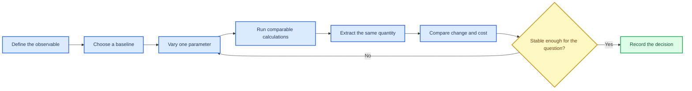

# Convergence as evidence

_Estimated time: 45 minutes | Difficulty: Intermediate | Last verified: 2026-09-05_

---

A convergence test is a controlled comparison, not a single "best" calculation. Change one numerical or modelling parameter at a time, measure the quantity that matters for your scientific question, and record the cost of the more accurate choice.

## 🎯 Learning goals

- Design a one-parameter-at-a-time convergence test
- Separate numerical convergence from model validation
- Compare accuracy, stability and computational cost
- Turn a group of runs into a traceable decision

## 🧪 The controlled comparison



## 📊 What to test

| Parameter | Example levels | Observable to compare |
| --- | --- | --- |
| Basis set | A small-to-larger sequence | Lattice parameter, bond length, energy difference |
| k-point sampling | Coarse-to-denser meshes | Total energy, Fermi-level states, band dispersion |
| SCF threshold | Moderate-to-tighter `TOLDEE` | Energy difference and property stability |
| Slab thickness | Increasing layer counts | Centre-layer structure and surface energy/property |
| Smearing or mixing | Several documented values | SCF stability and final electronic result |

The parameter levels must be appropriate to the model. Do not compare two runs that also changed the functional, basis, geometry, charge or k-point path unless the purpose is explicitly a method comparison.

## 🧮 Use a decision table

| Run | One changed parameter | Observable | Difference from previous run | Cost | Decision |
| --- | --- | --- | ---: | ---: | --- |
| 01 | Baseline | [value] | - | [time] | Reference |
| 02 | [parameter = level 2] | [value] | [delta] | [time] | Keep or continue |
| 03 | [parameter = level 3] | [value] | [delta] | [time] | Accept or reject |

"Converged" means stable with respect to the selected observable and tolerance. It does not mean that every possible property is insensitive to the same setting. State what was tested and what was not tested.

## 📝 Calculation passport entry

For each accepted setting, keep a short note in `notes/calculation-passport.md`:

```text
Question: [what this calculation supports]
Observable: [quantity used for the convergence decision]
Parameter varied: [one parameter]
Levels tested: [list]
Acceptance criterion: [numerical criterion and reason]
Selected level: [value]
Evidence: [input/output/plot paths]
Known limitation: [what was not tested]
```

This is where project management becomes scientific evidence: another student can reproduce the comparison and understand why the production setting was selected.

## 🚀 Next step

Continue to [Properties overview](07-properties-overview.md) once the parent SCF and geometry settings are validated.
