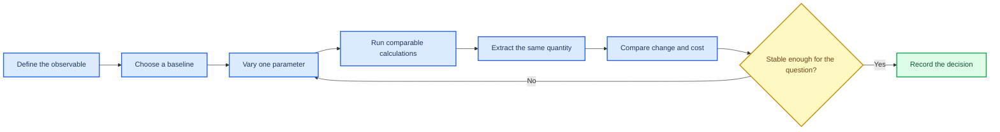

# Convergence as evidence

_Estimated time: 45 minutes | Difficulty: Intermediate | Last verified: 2026-09-05_

---

A convergence test is a controlled comparison. Change one numerical or modelling parameter at a time, measure a quantity relevant to your question and record the extra cost.

## 🎯 Learning goals

- Design a one-parameter-at-a-time convergence test
- Separate numerical convergence from model validation
- Compare accuracy, stability and computational cost
- Turn a group of runs into a traceable decision

## 🧪 The controlled comparison



## 📊 What to test

| Parameter | Example levels | Observable to compare |
| --- | --- | --- |
| Basis set | A small-to-larger sequence | Lattice parameter, bond length, energy difference |
| k-point sampling | Coarse-to-denser meshes | Total energy, Fermi-level states, band dispersion |
| SCF threshold | Moderate-to-tighter `TOLDEE` | Energy difference and property stability |
| Slab thickness | Increasing layer counts | Centre-layer structure and surface energy/property |
| Smearing or mixing | Several documented values | SCF stability and final electronic result |

Choose levels that suit the model. Keep the functional, basis, geometry, charge and k-point path fixed unless you are explicitly comparing methods.

## 🧮 Use a decision table

| Run | One changed parameter | Observable | Difference from previous run | Cost | Decision |
| --- | --- | --- | ---: | ---: | --- |
| 01 | Baseline | [value] | - | [time] | Reference |
| 02 | [parameter = level 2] | [value] | [delta] | [time] | Keep or continue |
| 03 | [parameter = level 3] | [value] | [delta] | [time] | Accept or reject |

"Converged" means stable for the selected observable and tolerance. It does not mean that every property is insensitive to the same setting. State what you tested and what you did not test.

## 📝 Calculation passport entry

For each accepted setting, keep a short note in `notes/calculation-passport.md`:

```text
Question: [what this calculation supports]
Observable: [quantity used for the convergence decision]
Parameter varied: [one parameter]
Levels tested: [list]
Acceptance criterion: [numerical criterion and reason]
Selected level: [value]
Evidence: [input/output/plot paths]
Known limitation: [what was not tested]
```

This note lets another student reproduce the comparison and understand why you selected the production setting.

## 🚀 Next step

Continue to [Properties overview](07-properties-overview.md) once the parent SCF and geometry settings are validated.
