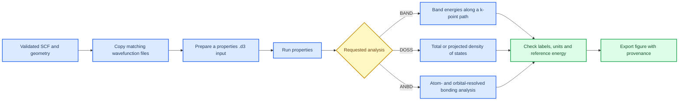

# Properties overview

_Estimated time: 35 minutes | Difficulty: Beginner to intermediate | Last verified: 2026-09-05_

---

Properties calculations are a second stage built on a previously converged CRYSTAL23 wavefunction. They do not repair an unconverged parent calculation. The safest workflow is therefore: validate the parent SCF and geometry first, copy the required restart files into a separate properties directory, run one property at a time, and record exactly what was projected or plotted.[^1]

## 🎯 Learning goals

- Confirm that a properties calculation uses the intended converged wavefunction
- Explain the difference between BAND, DOSS and ANBD
- Keep k-point paths and orbital projections traceable
- Diagnose missing or mismatched restart files

## 🔗 From parent calculation to property figure



## 🧰 What each analysis answers

| Analysis | Main question | Important input decision |
| --- | --- | --- |
| `BAND` | How do electronic energies vary along a selected reciprocal-space path? | The high-symmetry path must match the dimensionality and Brillouin zone of the model |
| `DOSS` | How many electronic states occur at each energy? | Define total DOS or atom/orbital projections and state the energy reference |
| `ANBD` | Which atom/orbital pairs contribute to bonding, antibonding or non-bonding interactions? | Define the atom pairs and orbital groups before interpreting the plot |

The same material can require different BAND paths for a three-dimensional bulk cell and a two-dimensional slab. This is not automatically an error, but the path and dimensionality must be stated in the figure caption or calculation passport. DOS does not use a line path in the same way, but it is still sensitive to k-point sampling and the quality of the parent wavefunction.[^1]

## 🗃️ Prepare a separate properties directory

Do not run properties directly over the only copy of a production optimisation. A minimal layout is:

```text
properties/run_01/
|-- parent-record.txt       # source calculation, method and convergence status
|-- parent.d3               # optional copied reference to the parent input
|-- fort.9                  # matching wavefunction/restart file
|-- fort.98                 # matching wavefunction/restart file, if required
|-- band.d3 or doss.d3      # hand-edited properties input
|-- properties.qsub         # submission script
`-- properties.out          # output to inspect before plotting
```

Use the file names expected by your local CRYSTAL23 wrapper. The key requirement is not the spelling of the directory; it is that every restart file comes from the same accepted parent calculation.

## 🔍 Properties checkpoint

Before plotting, answer these questions:

- [ ] Which parent input and output produced the wavefunction?
- [ ] Was the parent SCF converged, and was the geometry converged when required?
- [ ] Is the BAND path appropriate for bulk or slab dimensionality?
- [ ] Which atoms and orbitals are included in each DOSS or ANBD projection?
- [ ] Is the energy axis labelled with the correct units and reference, such as `E - E_F`?
- [ ] Can the final figure be traced back to the `.d3`, qsub script and `.out` file?

## ⚠️ What not to infer

A DOS peak does not identify a unique chemical mechanism by itself. Combine projected DOS with the structural model, charge or bonding analysis, and state the limits of the projection scheme. Likewise, a band crossing is evidence of an electronic feature along the selected path, not automatically a complete statement about transport or device performance.

## 📖 Official syntax reference

Use the [CRYSTAL properties tutorial](https://tutorials.crystalsolutions.eu/tutorial.html?td=properties&tf=properties_tut) for the complete keyword syntax for PPAN, ECHG, BAND, DOSS, COOP and COHP.[^1] This handbook adds the workflow checks and provenance record around those commands.

## 🚀 Next step

The next pages will treat [Band structure](08-band-structure.md) and [Density of states](09-density-of-states.md) as separate analyses so that path selection and projection choices are not mixed together.

## References

[^1]: CRYSTAL Solutions. (n.d.). *Properties tutorial*. https://tutorials.crystalsolutions.eu/tutorial.html?td=properties&tf=properties_tut
