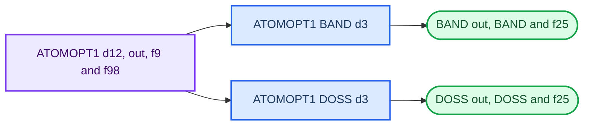

# Properties calculations

Properties calculations answer questions about a completed electronic structure. They use the wavefunction from a converged parent calculation rather than starting a new geometry calculation. In the example workflow, `ATOMOPT1` supplies the parent wavefunction for `ATOMOPT1_BAND` and `ATOMOPT1_DOSS`.

## What you will learn

You will learn why a property job needs a parent calculation, how `.d12` and `.d3` inputs differ, and how to check that the submitted command connects the right property to the right parent.

## Start with a checked parent

Before preparing a property, confirm that the parent calculation has the intended geometry and an SCF completion line. For an optimised structure, also confirm `OPT END - CONVERGED`. Then identify the wavefunction files that the property job will read:

```bash
ls ATOMOPT1.f9 ATOMOPT1.f98
```

The names in this command are examples. Use your parent calculation's base name. Do not create a BAND or DOSS result from a parent whose status is unknown.

## Parent-property relationship



The main CRYSTAL calculation is described by a `.d12` input; it produces the electronic structure and wavefunction. A properties input is a `.d3` file; it asks CRYSTAL to analyse that existing wavefunction and write a new, named result. This is why property files should carry both their own purpose and a visible connection to the parent.

| Property | Main question | Files to preserve with the plot |
| --- | --- | --- |
| BAND | How do state energies vary along the selected reciprocal-space path? | `.d3`, `.out`, `.BAND`, `.f25` and parent name |
| DOSS | Which selected states occur across the chosen energy range? | `.d3`, `.out`, `.DOSS`, `.f25`, projection groups and parent name |

## Prepare the properties qsub file

The completed `ATOMOPT1.qsub` contains a commented CRYSTAL line and an active properties line:

```text
#/rds/.../runcryP ATOMOPT1
/rds/.../runpropP ATOMOPT1_DOSS ATOMOPT1
```

The `#` at the start disables the line. This preserves the old command as a record while running `runpropP` for the property calculation. The exact installation path is cluster-specific and should be copied from the working `.qsub` file.

For the completed project, the existing `ATOMOPT1.qsub` was edited for the property run. This is one working pattern, not a requirement to use one script for every property. The essential check is that the active `runpropP` command names the intended property base name first and the intended parent base name second.

For future runs, preserve the previous version before editing:

```bash
cp ATOMOPT1.qsub ATOMOPT1.qsub.before-property
vi ATOMOPT1.qsub
```

Before submission, check the relevant lines:

```bash
cat ATOMOPT1.qsub
```

## Submit and check

```bash
qsub ATOMOPT1.qsub
```

```bash
qstat -u $USER
```

```bash
ls -rtl
```

The active line in the script selects the property task and its parent, for example:

```text
/rds/.../runpropP ATOMOPT1_DOSS ATOMOPT1
```

The same script can be edited for a BAND run by changing the property base name. Keeping the pre-edit copy is a project-management improvement: it allows the command used for each result to be reconstructed.

After completion, retain the property output and data:

```text
ATOMOPT1_BAND.out
ATOMOPT1_BAND.BAND
ATOMOPT1_BAND.f25
ATOMOPT1_DOSS.out
ATOMOPT1_DOSS.DOSS
ATOMOPT1_DOSS.f25
```

Use the actual names printed by the scheduler output if they differ. Keep the property input, submitted script, output and data together so that a plotted result can be traced back to its parent.

## Syntax source

Use the [official CRYSTAL properties tutorial](https://tutorials.crystalsolutions.eu/tutorial.html?td=properties&tf=properties_tut) for `.d3` syntax. Use [CrySPLOT](https://crysplot.crystalsolutions.eu/index.html) to inspect supported property data after the job completes. These sources explain syntax and plotting; the project record explains which parent and files were used.

## Checkpoint

Before analysing a property result, write down the property base name, parent base name, parent convergence status, `.d3` filename and output filename. Check that these names agree with the active `runpropP` line.

## Next

Continue to [Band structure](08-band-structure.md) or [Density of states](09-density-of-states.md).
