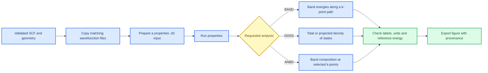

# Properties overview

_Estimated time: 35 minutes | Difficulty: Beginner to intermediate | Last verified: 2026-09-05_

---

Properties calculations use a CRYSTAL23 wavefunction generated earlier. They cannot repair an unconverged parent run. First validate the parent SCF and geometry. Then copy the required restart files into a separate directory, run one property at a time and record what you plotted.[^1]

## 🎯 Learning goals

- Confirm that a properties calculation uses the intended converged wavefunction
- Explain the difference between BAND, DOSS and ANBD
- Keep k-point paths and orbital projections traceable
- Diagnose missing or mismatched restart files

## 🔗 From parent calculation to property figure



## 🧰 What each analysis answers

| Analysis | Main question | Important input decision |
| --- | --- | --- |
| `BAND` | How do electronic energies vary along a selected reciprocal-space path? | The high-symmetry path must match the dimensionality and Brillouin zone of the model |
| `DOSS` | How many electronic states occur at each energy? | Define total DOS or atom/orbital projections and state the energy reference |
| `ANBD` | What is the atomic-orbital character of selected eigenstates at selected k-points? | Record the k-points, bands and coefficient threshold |

The same material can require different BAND paths for a three-dimensional bulk cell and a two-dimensional slab. State the path and dimensionality in the figure caption or calculation passport. DOS does not use a line path, but it is still sensitive to k-point sampling and the parent wavefunction.[^1]

## 🗃️ Prepare a separate properties directory

Do not run properties over the only copy of a production optimisation. Use a separate directory:

```text
properties/run_01/
|-- parent-record.txt       # source calculation, method and convergence status
|-- parent.d12              # copy of the parent calculation input
|-- fort.9                  # matching wavefunction/restart file
|-- fort.98                 # matching wavefunction/restart file, if required
|-- band.d3 or doss.d3      # hand-edited properties input
|-- properties.qsub         # submission script
`-- properties.out          # output to inspect before plotting
```

Use the file names expected by your local wrapper. Every restart file must come from the same accepted parent calculation.

## 🧪 Build one properties run

The commands below show the file-management sequence. Replace the parent path and template path with the real locations:

```bash
mkdir -p ~/crystal23-training/properties/band_01
cd ~/crystal23-training/properties/band_01
cp /path/to/accepted-parent/parent.d12 .
cp /path/to/accepted-parent/parent.out .
cp /path/to/accepted-parent/fort.9 .
cp /path/to/working-template/band.d3 .
cp /path/to/working-template/band.qsub .
ls -lah
```

Some local workflows require `fort.98` or another restart filename instead of, or in addition to, `fort.9`. Copy exactly the files named by the validated properties template and record their parent directory.

Create the provenance record before editing:

```bash
cat > parent-record.txt <<'EOF'
Parent directory: /path/to/accepted-parent
Parent input: parent.d12
Parent output: parent.out
SCF status: converged
Geometry status: [converged / not requested]
Wavefunction copied: fort.9
EOF
```

Edit the `.d3` using the [official properties tutorial](https://tutorials.crystalsolutions.eu/tutorial.html?td=properties&tf=properties_tut) and a working group example:

```bash
vi band.d3
less band.d3
```

Then inspect the submission script:

```bash
grep -n "runcryP\|runpropP" band.qsub
```

The main `.d12` calculation normally calls the CRYSTAL executable, often through a local command such as `runcryP`. A `.d3` properties calculation must call the properties executable expected by the local installation, recorded in the project note as `runpropP`. Copy a working properties script and confirm this line; changing the program name alone cannot repair incorrect paths or restart files.

In a shell script, a line beginning with `#` is a comment and is not executed. Comments can preserve a short note about an old analysis, but do not comment out required setup lines merely because they contain a path.

Submit and monitor:

```bash
qsub band.qsub
qstat -u "$USER"
```

After the job leaves the queue:

```bash
ls -rtl
grep -n -i "error\|warning\|band" band.out
tail -n 80 band.out
```

Use the actual output name created by your template. Only proceed to plotting after confirming that the requested analysis completed.

## 🔍 Properties checkpoint

Before plotting, answer these questions:

- [ ] Which parent input and output produced the wavefunction?
- [ ] Was the parent SCF converged, and was the geometry converged when required?
- [ ] Is the BAND path appropriate for bulk or slab dimensionality?
- [ ] Which atoms and orbitals are included in each DOSS projection or ANBD state analysis?
- [ ] Is the energy axis labelled with the correct units and reference, such as `E - E_F`?
- [ ] Can the final figure be traced back to the `.d3`, qsub script and `.out` file?

## ⚠️ What not to infer

A DOS peak does not identify a unique chemical mechanism. Compare projected DOS with the structure and, where relevant, charge or bonding analysis. ANBD can identify the character of a selected state, but it does not replace a BAND path or DOS. A band crossing shows an electronic feature along the selected path; it does not by itself establish transport or device performance.

## 📖 Official syntax reference

Use the [CRYSTAL properties tutorial](https://tutorials.crystalsolutions.eu/tutorial.html?td=properties&tf=properties_tut) for the full syntax of PPAN, ECHG, BAND, DOSS, COOP and COHP.[^1] This handbook explains the checks around those commands.

## 📈 Plot and inspect the result

[CrySPLOT](https://crysplot.crystalsolutions.eu/index.html) is the CRYSTAL Solutions plotting interface for supported output files.[^2] Use it after the properties run has completed and passed the checks above.

1. Keep the original CRYSTAL output and property data.
2. Open the supported file in CrySPLOT.
3. Check the energy unit, reference energy, path labels and projection labels.
4. Export the figure with a name that points back to the calculation.

> 📌 **Remember:** A plotting tool displays the data you give it. It does not confirm that the parent SCF converged, the BAND path is correct or the projection answers your question.

## 🚀 Next step

The next pages will treat [Band structure](08-band-structure.md) and [Density of states](09-density-of-states.md) as separate analyses so that path selection and projection choices are not mixed together.

## References

[^1]: CRYSTAL Solutions. (n.d.). *Properties tutorial*. https://tutorials.crystalsolutions.eu/tutorial.html?td=properties&tf=properties_tut
[^2]: CRYSTAL Solutions. (n.d.). *CrySPLOT*. https://crysplot.crystalsolutions.eu/index.html
